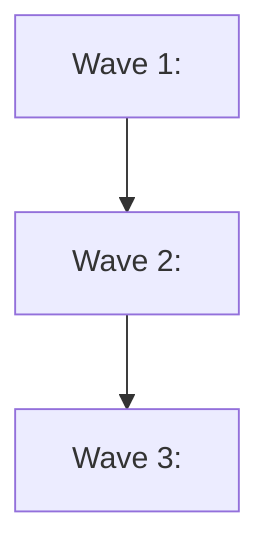

# <track> — Phase Plan

> The task source of truth. Claim a task by appending `— claimed by <sid> @ <yyyy-MM-dd HH:mm>` to
> its line; finish it with `✅ by <sid> <date>`. Never edit a line another session claimed.
> Your incoming queue = unclaimed tasks in your zones.

## Phase <N> — <name>

- [ ] **<N.M> <task>** — <acceptance criteria one-liner>
- [ ] **<N.M+1> <task>** — <…>
- [ ] ✅ **<N.M-1> <done task>** — ✅ by sess-<id> <date> · <verification numbers> · <commit>

### Wave DAG (one node per wave; close-out needs this in the summary)

